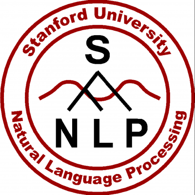

## Backend Part

### Technology
#### Django

Django is a free and open-source web framework, written in Python, which follows the model-view-template (MVT) architectural pattern. 

Django makes it easier to build better Web apps more quickly and with less code, it emphasizes reusability and "pluggability" of components, less code, low coupling, rapid development, and the principle of don't repeat yourself. It also provides an optional administrative create, read, update and delete interface, which is generated dynamically through introspection and configured via admin models. 

#### Python 3

Python is an interpreted high-level programming language for general-purpose programming. Python has a design philosophy that emphasizes code readability, notably using significant whitespace. It provides constructs that enable clear programming on both small and large scales. 

Python features a dynamic type system and automatic memory management. It supports multiple programming paradigms, including object-oriented, imperative, functional and procedural, and has a large and comprehensive standard library. It is cross-platform and it interpreters are available for many operating systems.

#### Nginx

Nginx is a web server which can also be used as a reverse proxy, load balancer, mail proxy and HTTP cache. Nginx can be deployed to serve dynamic HTTP content on the network using FastCGI, SCGI handlers for scripts, WSGI application servers or Phusion Passenger modules, and it can serve as a software load balancer.

Nginx uses an asynchronous event-driven approach, rather than threads, to handle requests. Nginx's modular event-driven architecture can provide more predictable performance under high loads.

#### Standford CoreNLP

CoreNLP is a program of natural language processing, it provides a set of human language technology tools. It can give the base forms of words, their parts of speech, whether they are names of companies, people, etc.

It make it very easy to apply a bunch of linguistic analysis tools to a piece of text. A tool pipeline can be run on a piece of plain text with just two lines of code. CoreNLP is designed to be highly flexible and extensible. With a single option you can change which tools should be enabled and disabled. 

#### Django-rest-framework

Django REST framework is a powerful and flexible toolkit for building Web APIs.

REST framework use packages for OAuth1a and OAuth2 in Authentication policies, its serialization that supports both ORM and non-ORM data sources. It customizable all the way down, and it has extensive documentation and great community support.