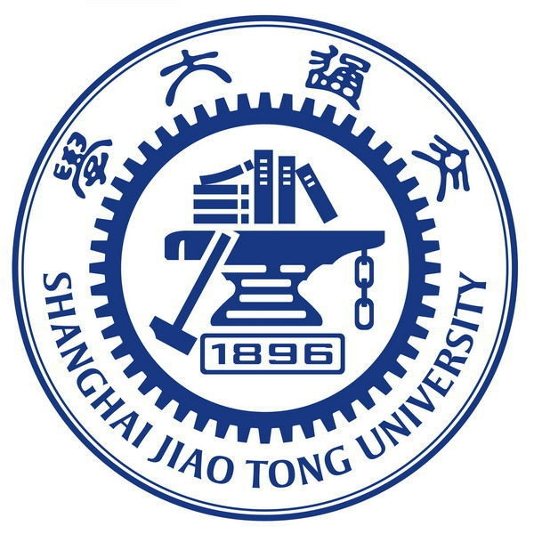

# Collaborations

## SJTU-Software

​	We have always maintained a good relationship with SJTU. We met at Taiwan and shared our thoughts about the development of Biohub with them. They think highly of the feature of experiment record. 

​	"Your experiment recording provides a simple and quick method for routine experiment. It could save a lot of time for us experimenters. They create the template of the experiment process which could record each experiment clearly and show the experiment to others easily. It is very convenient to sharing the ideas of experiment and communicate with each other. However, there are also some things which need to be improved. Some experiments may do two or more things in the same time, for example, when experimenters centrifuge something and they need to operate supernatant and precipitate separately so that it may be better to improve the function at these situations. Also, you could add visualization function in the editor which makes the showing process more clearly." 

​	We really appreciate their suggestions and now we are doing our best to improve our project.

## UESTC

​	We invited UESTC to experience Biohub and they gave us useful feedback. "Biohub’s UI is awesome and has a sense of science and technology. Also, Biohub can respond fast and smoothly. However, there are also some places need to be improved. For example, there is no introduction to the function of Biohub at its homepage. Besides, it would be better to add the user guide to editor which could be very important for green hands."

​	 We have got a lot from their feedback and now we have improved our function and made our project better. 

## USTC

​	We had communicated with Team USTC frequently and realized that writing the experiment reports may be a difficult and duplicated thing. We got the inspiration from them and decided to develop our project now. During the process of developing, they helped us to build a professional and easy-to-use editor and a powerful search engine to help experimenters work effectively. They provide the knowledge we need and experience the functions and help us improving our project.

