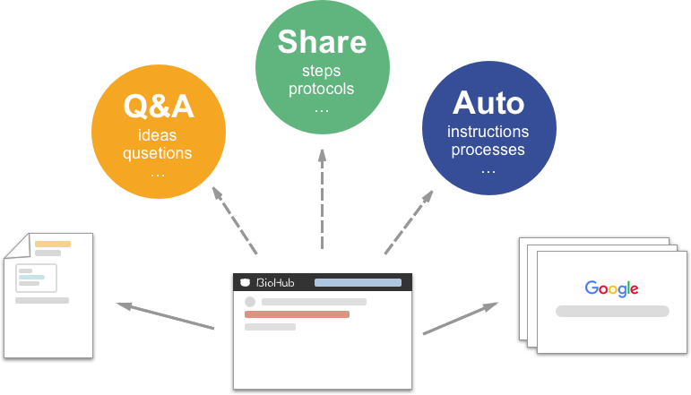

# Project

## Description

### Overview

### What is BioHub 3.0?

BioHub 3.0 is a synthetic biology community, integrated **Intelligent Search Engine** and the online report **editor**. It brings you a new way to edit your reports and search whatever you need only in one step.

#### The Editor

We established a standardized description of experimental steps. The editor can help you complete high-quality lab reports quickly just by choosing steps and filling in the blanks. Custom steps and protocols are also supported. And in our report editor, biologists could use a number of practical tools such as drawing, tabulation and writing articles, which improve the efficiency of completing the experiment report.

#### Intelligent Search Engine

We developed our search engine on the base of 2017's project. Our engine has a better command of language recognition. It supports **semantic recognition**, like "reports today", "reports by ana", "reports this year" and edc.. Meanwhile, we listened to the opinions of the judges. This year we added **advanced search** and we can now sort the results by time, labels, etc.. It is easier for synthetic biologists to find what they need without many input's instructions. Additionally, we have added many useful databases and academic websites to our search engine, so biologists could search information more quickly.

#### The community

In this community, bio workers can record their experimental process and release those reports. Meanwhile, they could also read and comment on other scholar's reports. In this way, we make the academic discussion more convinent.  We provide both site search and off-site search to provide better user experience.

### Motivation

After consulting with several synthetic biology workers, we found that they would inevitably suffer from the need to spend a lot of time to complete the experimental report during the experiment. Therefore, there is an urgent need for a editor that provides a number of practical tools such as drawing, tabulation, writing articles by dragging steps or protocols to improve the efficiency. So it can replace the original Pages or Microsoft Office for its convenience.

As we all know, too programmer-style search engine is very unfriendly to synthetic biologists, so we reidesigned functions of search engines. Researchers can easily find reports written by others after inputting some key words. They could also search information in some databases and websites directly though this engine.      

 For most synthetic biology workers, it is difficult for them to conduct effective communication on experimental content, so we established a synthetic biology community based on search engine and report editor. In this community, bio workers can use this to record their experimental process and comment on other scholar's reports, thereby reducing the blindness of the research.

### In the future 

As the advanced architecture and plugin system designed in our Biohub 3.0. It's pretty easy to improve our existed functions and  provide new function by activating new plugins. Here are what we want to do in the future.

#### Improvements

It is super easy to accomplish  your report rapidly by useing our editor. But we can make it better.

- We believe it is possible to share your `protocols` and `steps` with anyone freely.
- It is great significant  to make it more efficient to build a new step or protocol.
- Our editor takes too much memories and will be slow down when the report goes long.

The `Search Engine` at the moment supports searching by nature language thanks to the new nature language processing  technology. The intelligence can be improved in understanding what users want and reacting more smartly. On the other hand, we can integrate more databases which are most used by biologists.

The society  is still growing. That is why chatting and communication  could be considered as an important facility in our society.

#### New features

Several Interface has been implemented to make it easy to improve Biohub in the future without refactoring core codes. New codes can be considered as a module or  plugin.

In the next generation of Biohub, We want to strengthen our society and build a society like `Quora` where biologists  can post their ideas, ask questions, sale their e-books, have a free chat or find partners who share interest in a certain area.

If there is a matching hardware port, it could complete the experiment automatically according to the given steps and protocols. We could match the steps or protocols to the manipulator's operating instructions accurately. For this, we hope BioHub can help achieve experiment automation.

