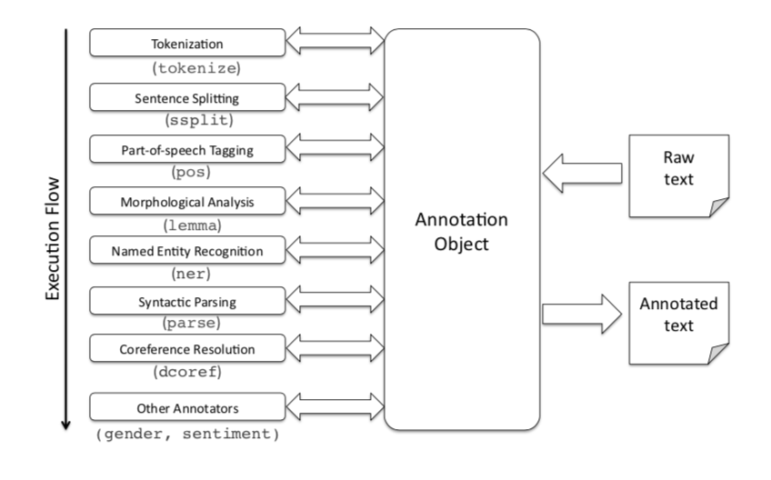

# Model

There're two outstanding models supporting our project:

- **Natural language processing (NLP)** 
- **Object-relational mapping (ORM)**
- **WebSocket**

## **Natural language processing (NLP)** 

Natural language processing (NLP) is an area of computer science and artificial intelligence that is concerned with the interaction between computers and humans in natural language.

The ultimate goal of NLP is to enable computers to understand language as well as we do.

For example, we can use these keywords to search:

```
molecular biology
```

But NLP give us the power to get closer to what we actually want to search:

```
molecular biology by Someone this year with #immunity
```

NLP can extract all the information and construct a query action:

```
keyword: molecular biology
author: Someone
time: this year
label: #immunity
```

In our project, we use an open-source software named **Stanford CoreNLP** (https://stanfordnlp.github.io/CoreNLP/) to parse the search string.



CoreNLP provides many underlying models so that we can get analysis information to construct more expressive and more human-friendly query.

## **Object-relational mapping (ORM)**

Object-Relational Mapping (ORM) allows us to work with objects and have them saved to the database automatically. It can greatly simplify create-read-update-delete (CRUD) operations and make our code more comprehensive.

ORM makes our `user`,`report`,`notice` and more models easy to query, to list and to link to each other.


In our project, we use **Django ORM** with MySQL backend as the underlying models to provide fast and flexible queries.

## **WebSocket**

WebSocket is a computer communications protocol, providing full-duplex communication channels over a single TCP connection. The HTML5 WebSockets specification defines an API that enables web pages to use the WebSockets protocol for two-way communication with a remote host. It introduces the WebSocket interface and defines a full-duplex communication channel that operates through a single socket over the Web. HTML5 WebSockets provide an enormous reduction in unnecessary network traffic and latency compared to the unscalable polling and long-polling solutions that were used to simulate a full-duplex connection by maintaining two connections.


In out project, we use WebSocket protocol to push our notifications. The WebSocket protocol makes the new notifications even real-time fast to be received.

