# User Guide of BioHub 3.0

## Overview

The brand new [BioHub 3.0](https://biohub.tech) has arrived to make your job easier than ever before. This year we bring you a new way to edit your reports and search whatever you need in one step. Here are some new features:

* An editor which can automatically compile your experimental reports.
* An intelligent search engine based on machine learning.
* A society that shares your ideas.

Click [here](https://biohub.tech) to take it a try. You'll learn how to get started and gain confidence that Biohub 3.0 can do whatever you need it to do.

## FeedBack

All we want to do is to make your work easier and we want to make it even further. If you have any suggestions, please create issues on our [Github repository](https://github.com/USTCSoftware2018/Frontend).

## Getting Started

Have a first look at our website. There are three tags which are `reports`, `iGEMers`.

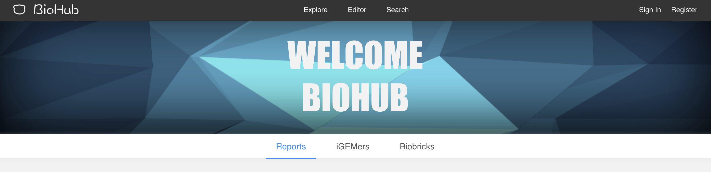.

`Reports` shows some most popular reports which are recommended by our algorithm. Click these articles and you can see what your partners are doing. Feel free to leave a comment on these reports.

`iGEMers` is a major part of our website. In this part, you can find those persons who share a common interest.

## Apply an account

Now, let's apply an account to enjoy Biohub 3.0. In the right of navigator located `Sign in` and `Register` buttons. Click the `Register` button to apply a new account. **We promise to protect users privacy.**

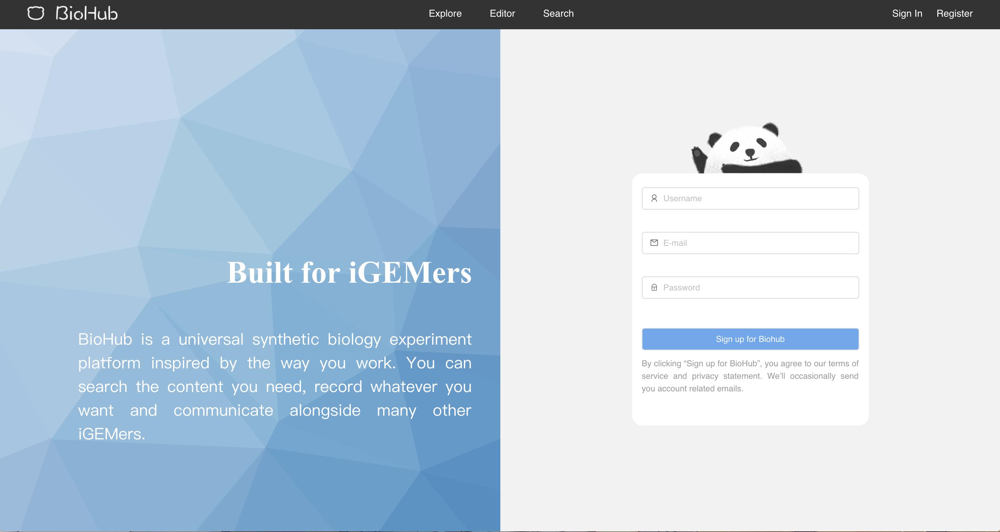

Look! A lovely panda is shaking its hands to welcome you once you hang your mouse over it.

## Edit a new report

This online `editor` is a good way of recording your experiment. Once finishing reading this brief guide, you will know how fast and how easy we can achieve this goal.

We divide an experiment report into three parts: `info`, `protocol` and `Result`

Here is the appearance of our `editor` and it initials an empty report when the `editor` button on the top is clicked:

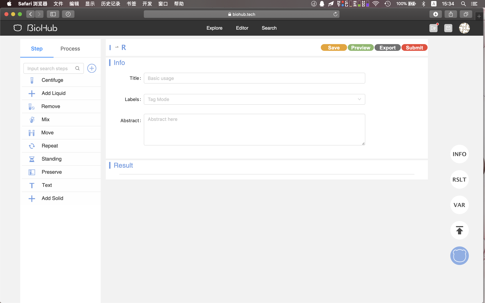

In the Info block, you can input title, labels and abstract like this:

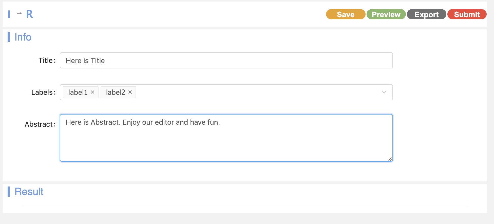

On the left side is a toolbox that contains `protocols` and `steps`. You can see there are some several steps and protocol that is created for you, you can create more steps and protocols as you wish.

Now let's click the `Add` step to see what will happen.

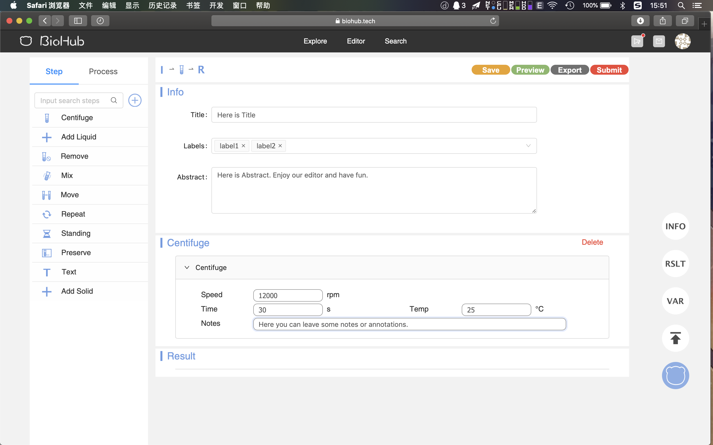

A new `Centrifuge` Step is inserted into the report. The only thing you need to do is to fill some blanks. That is how you record a '12000 rpm centrifuge for 30 s at 25 degrees.'. Is that amazing? But we can make it much faster.

`protocol` is a set of steps or a template. Let's try `Gel Extraction`.

A serial of steps is inserted into your report and most of these blanks are accomplished by our templates.

It is true that the available `steps` and `protocols` are not able to meet all your demands. But you can create new steps and protocol. Here is an example:

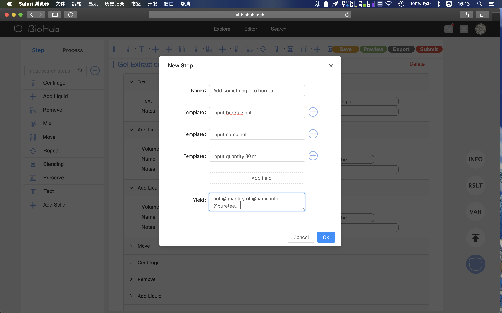

A new `step` called `Add something into burette` is created in the step bar and you can insert it into your report.

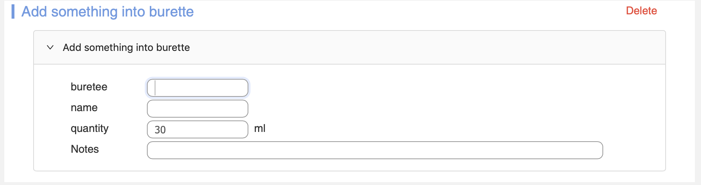

`Environment Variable` is another way to help you to accomplish your writing. Click the `VAR` button and define some variables.

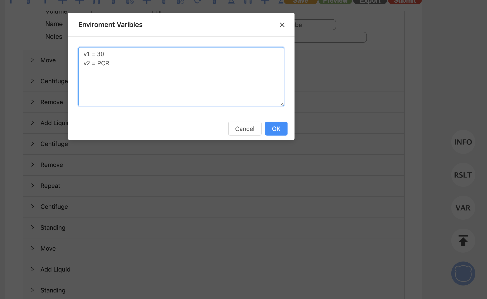

In that way, the `editor` will replace all `@v1` pattern into `30` and `@v2` pattern into `PCR` in the report.

The third section of a report is results. In this section, it is free to insert some texts, pictures, lists, and tables to record the results.

Click these buttons on the right side of the editor to insert them into your report.

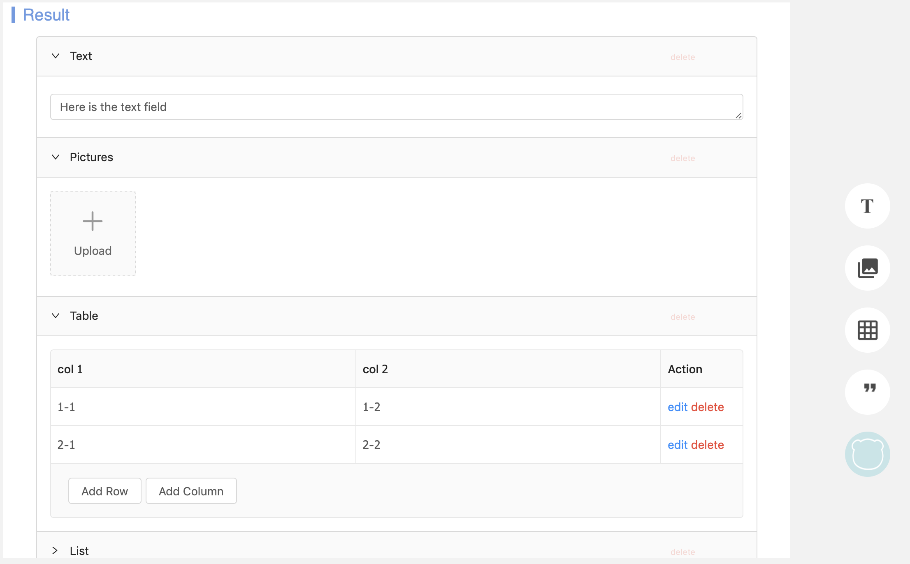

If you can not find those buttons, click the little blue cat button.

After finishing editing, click the `Save` button to save it and `preview` button to have a look of your work.

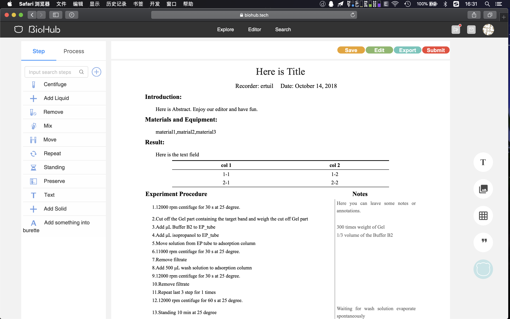

You can see all sentences are produced automatically. Click `Export` button to download your work in `PDF`.

## Intelligent Search Engine

Our Search Engine is much more Intelligent and useful than Biohub 2.0.

It not only supports searching Users or Articles, but also supports customize filter and sort rules in **natural language**. It means we support sentences like 'reports by Jiyan in this year' and 'reports with label PCR'. It is gorgeous and easy to use.

We support an integrated search that is connected to more than 50 websites like NLM, PubMed, PMC and so on.

`Bio-bricks` is the traditional function in Biohub 2.0, and it will be supported in the long term. `BLAST` is useful to search gene segment like 'AGGT'.

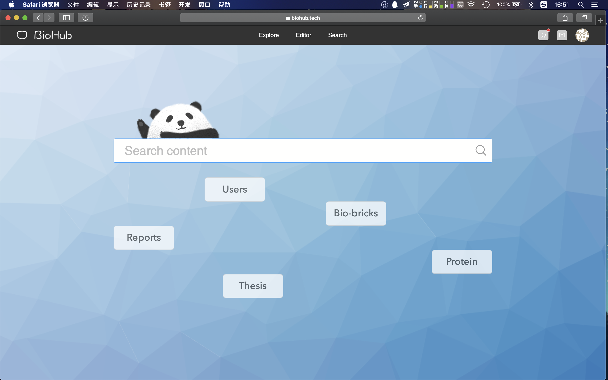

## Society

You can see the details of all reports and leave a comment or like the report. In that way, the author will receive the feeds.

In that way, we build a scientific society where the academic discussion is possible

## For more information

If you want to learn more about Biohub 3.0, please contact us on [github](https://github.com/USTCSoftware2018).
